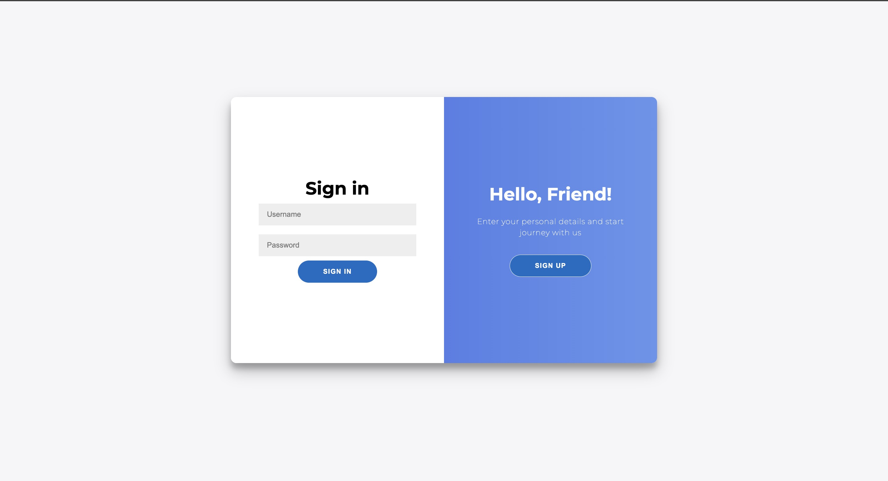
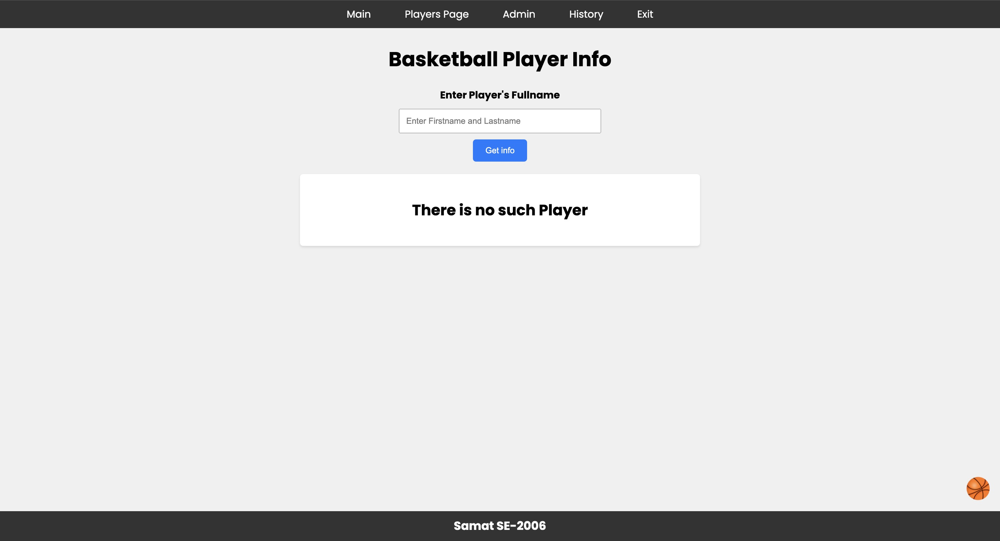
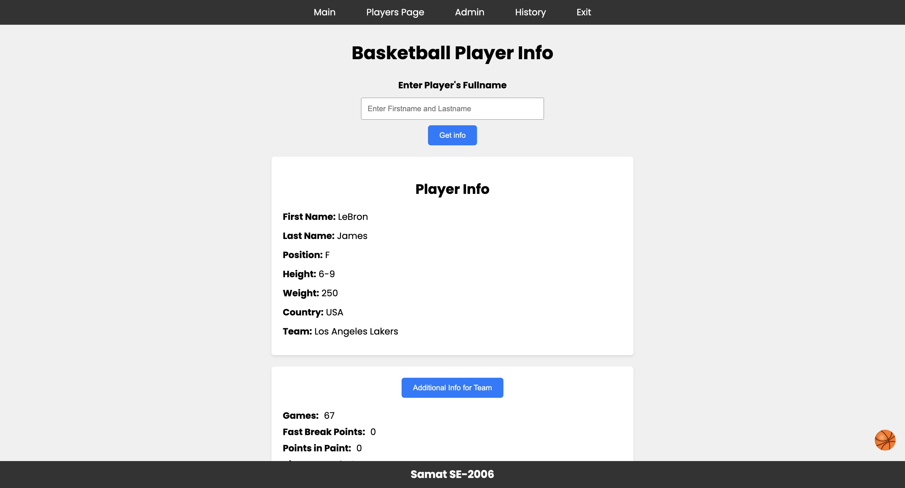
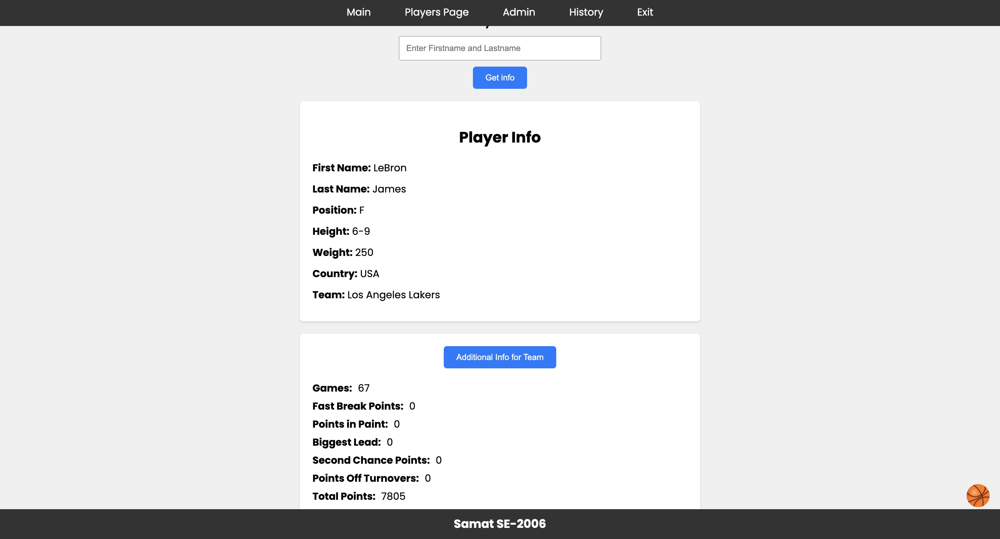
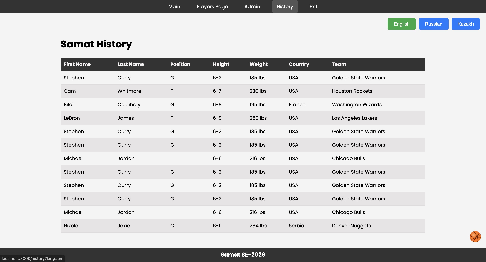
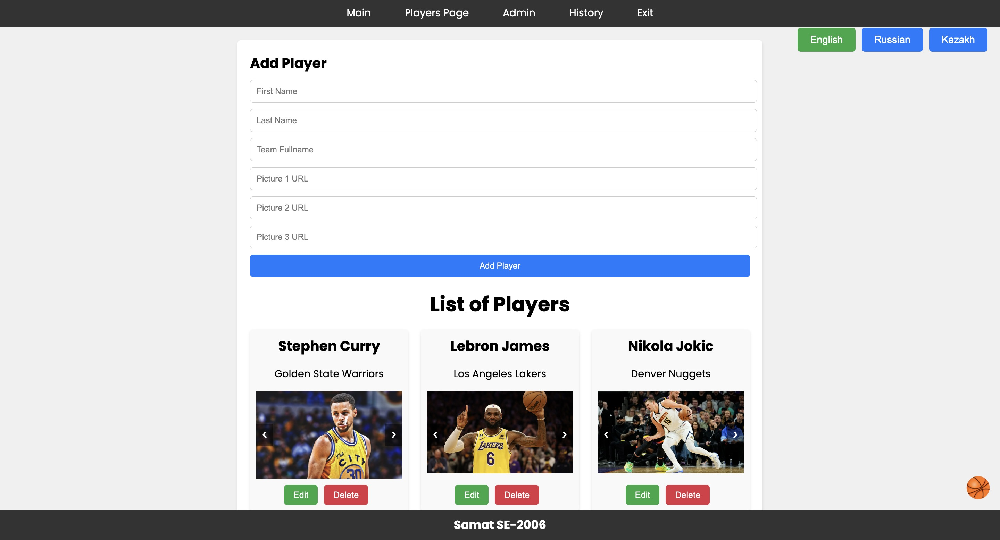

# NBA Players Stats

## Installation

To install and run this application, follow these steps:

1. Clone the repository:

```bash
git clone https://github.com/samekeekz/web-final
```

2. Go to the folder:

```bash
cd project_folder
```

2. Install dependencies:

```bash
npm i
```

## Running the Application

After installation, start the server using one of the following commands:

```bash
npm run dev
```

The server will be running at http://localhost:3000

### API keys and admin username and password are in the `.env` file

## External APIs

The NBA Players Stats website utilizes external APIs to gather player statistics and other relevant data.

### Balldontlie API

The Balldontlie API is used to retrieve player data based on the provided player name.

- **Endpoint:** `https://api.balldontlie.io/v1/players`
- **Documentation:** [Balldontlie API Documentation](https://balldontlie.io/#get-all-players)

### NBA API-Sports

The NBA API-Sports is used to fetch team statistics and other NBA-related data.

- **Endpoint:** `https://v2.nba.api-sports.io/`
- **Documentation:** [NBA API-Sports Documentation](https://rapidapi.com/theapiguy/api/free-nba)

### Used dependencies

- `express`
- `body-parser`
- `bcrypt`
- `express-session`
- `path`
- `cors`
- `axios`
- `mongoose`
- `i18n`

## Main Endpoints

- **GET /main:** Renders the main page of the NBA Players Stats website.
- **GET /players:** Renders the players page displaying a list of NBA players.
- **POST /getPlayerInfo:** Retrieves player information based on the provided full name.
- **GET /history:** Renders the history page displaying the user's search history.
- **POST /teamStats:** Retrieves statistics for a specified NBA team.
- **GET /adminPage:** Renders the admin page for managing player data.
- **GET /admin/players:** Retrieves and renders the admin page with player data.
- **POST /admin/add:** Adds a new player to the database.
- **POST /admin/update:** Updates player information in the database.
- **DELETE /admin/delete:** Deletes a player from the database.

These endpoints handle various functionalities of the NBA Players Stats website, including retrieving player data, managing user sessions, and performing administrative tasks.

## Short summary of the project

1. First user should register/login to the site.
   

2. Then it redirects to main page.
   

3. After that user can search data about player.
   

4. Also there is additional info of player's team.
   

5. Then user can see history of his/her own requests.
   

6. The admin page looks like this:
   

To get in admin page write:

- login: Samat
- password: Qwerty1

7. Finally when user clicks button "Exit" it redirects to register/login page.
